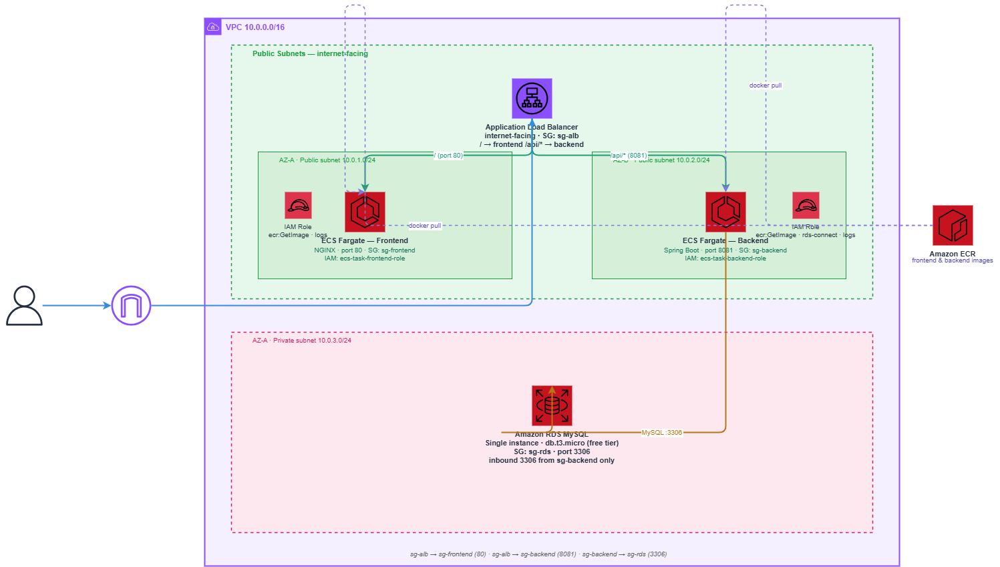

# 🚀 Employee Management App – Containerized Infrastructure (AWS ECS + Terraform)

## 📌 Overview

This repository provisions a **modern, cloud-native infrastructure** for the Employee Management Application using **Terraform** and **AWS ECS (Fargate)**.

The project demonstrates a **real-world DevOps evolution**:

```text
Traditional EC2 Deployment → Containerization → CI/CD → Secure HTTPS Deployment
```

The application is now fully accessible via a **custom domain with HTTPS**:

```text
https://uppoor.online
https://www.uppoor.online
```

---

## 🌐 Live Application

The application is publicly accessible using a **custom domain configured via Namecheap and AWS ACM**:

* ✅ https://uppoor.online
* ✅ https://www.uppoor.online

Features:

* Secure HTTPS connection (SSL/TLS)
* Automatic HTTP → HTTPS redirection
* Domain mapped to AWS Application Load Balancer

---

## 🏗️ Architecture

The infrastructure uses **Amazon ECS (Fargate)** to run containerized services behind an **Application Load Balancer with HTTPS support**.

### High Level Flow



---

## 🔧 Infrastructure Components

### 🌐 VPC & Networking

* Custom VPC with CIDR block
* Public subnets (ALB + ECS tasks)
* Private subnets (RDS)
* Internet Gateway & Route Tables

> 💡 ECS tasks run in **public subnets with public IPs** to avoid NAT Gateway costs (free-tier optimization).

---

### ⚖️ Application Load Balancer (ALB)

* Internet-facing ALB
* **HTTPS enabled using AWS ACM certificate**
* Domain mapped via Namecheap DNS
* Path-based routing:

```text
/        → Frontend (React + NGINX)
/api/*   → Backend (Spring Boot)
```

* Health checks:

  * Frontend → `/`
  * Backend → `/actuator/health`

* HTTP (80) → Redirects to HTTPS (443)

---

### 🔐 HTTPS & Domain Setup

* Domain purchased from **Namecheap**
* DNS configured to point to ALB
* SSL certificate provisioned via **AWS ACM**
* Secure communication enforced across the application

Flow:

```text
User → Domain (uppoor.online) → ALB (HTTPS) → ECS Services → RDS
```

---

### 🐳 Amazon ECS (Fargate)

* ECS Cluster for container orchestration

* Two services:

  * **Frontend Service (NGINX, Port 80)**
  * **Backend Service (Spring Boot, Port 8081)**

* Task Definitions include:

  * CPU & Memory configuration
  * Container images from ECR
  * Environment variables (DB config)

Benefits:

* No server management
* High availability
* Scalable architecture

---

### 📦 Amazon ECR (Elastic Container Registry)

* Stores Docker images:

  * `employee-frontend`
  * `employee-backend`
* Integrated with CI/CD pipeline

---

### 🛢️ Amazon RDS (MySQL)

* Deployed in private subnets
* Not publicly accessible
* Backend connects securely via security groups

---

### 🔐 IAM Roles & Security

* ECS Task Execution Role for ECR access
* Security Groups:

  * ALB → allows HTTP (80) & HTTPS (443)
  * ECS → accepts traffic only from ALB
  * RDS → accepts traffic only from ECS

---

## 🔄 CI/CD Integration

Implemented using **GitHub Actions**:

### Pipeline Flow

```text
Developer → GitHub → GitHub Actions → Docker Build → ECR → ECS Deployment
```

### Steps:

1. Build Docker images:

   * Frontend
   * Backend
2. Push images to Amazon ECR
3. ECS services pull latest images and deploy

---

## ⚙️ Deployment Steps

Initialize Terraform:

```bash
terraform init
```

Preview changes:

```bash
terraform plan
```

Apply infrastructure:

```bash
terraform apply
```

Destroy infrastructure (optional):

```bash
terraform destroy
```

---

## 🔐 Security Considerations

* RDS deployed in **private subnets**
* Backend not directly exposed to internet
* HTTPS enforced using ACM
* Traffic controlled via security groups
* HTTP automatically redirected to HTTPS

---

## 📈 Key Highlights

* Fully containerized architecture using Docker
* Secure HTTPS setup with custom domain
* Path-based routing using ALB
* CI/CD pipeline using GitHub Actions
* Infrastructure managed via Terraform
* Cost-optimized (no NAT Gateway)

---

## 🔮 Future Improvements

* Auto Scaling for ECS services
* AWS Secrets Manager for DB credentials
* CloudWatch monitoring & alerts
* Blue/Green deployments
* AWS WAF for security
* Custom domain with Route 53 (optional upgrade)

---

## 👨‍💻 Author

Developed as part of a **Cloud & DevOps portfolio project** demonstrating:

* Infrastructure as Code (Terraform)
* Containerization (Docker)
* Orchestration (AWS ECS)
* CI/CD pipelines
* Secure cloud deployments (HTTPS + domain mapping)

---

## ⭐ Final Note

This project reflects **production-grade architecture**, including:

```text
Secure Domain → HTTPS → ALB → ECS → RDS
```

It showcases the ability to design, deploy, and manage **end-to-end cloud-native applications using modern DevOps practices**.
